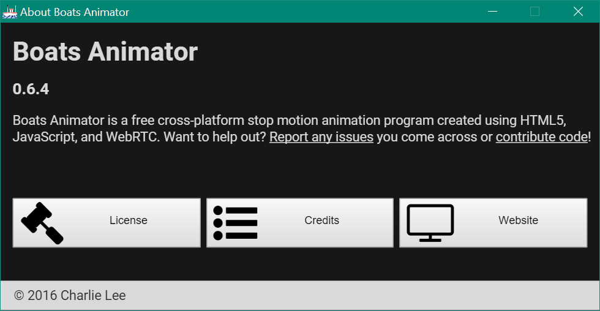

# About window

The about window is displayed when `Help > About Boats Animator` is selected from the [menu bar](main-window.md#menu-bar).

## License
Select this to read a copy of Boats Animator's [GPL v3](https://github.com/charlielee/boats-animator/blob/master/LICENSE) license.

## Credits
Select this to see [who has contributed](https://github.com/charlielee/boats-animator/graphs/contributors) to the development of Boats Animator.

## Website
Select this to visit [charlielee.uk/boats-animator](http://charlielee.uk/boats-animator).