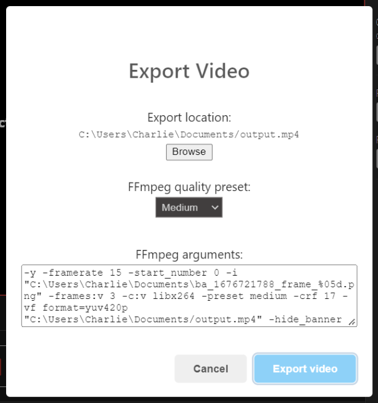

# Export Video

Captured frames can be rendered as a video file via the FFmpeg library. To render a video file, select the "Export video" option from the sidebar of the [main window](/interface/main-window). You must capture at least one frame for this option to be available.

## Selecting a file location

Selecting "Export video" will display a file picker to choose a file name and location to store the rendered video. Select "Save" when a suitable location has been found.

## Video export options

After selecting an export location, the export video dialog will be visible. Select "Export video" when you ready to begin the video rendering process.

### Export location

Select "browse" to change the selected file name and location for the video file.

### FFmpeg quality preset

This option allows for basic adjustment to the output video's quality. See the [FFmpeg Wiki](https://trac.ffmpeg.org/wiki/Encode/H.264) for further information on presets.

In general, choosing a **slower** preset will provide better compression (quality per filesize) to the output video file. Use the slowest preset that you have patience for!

### FFmpeg arguments

This option allows manual adjustment to the FFmpeg command line arguments that will be used the render the video file. A list of available options is available in the [FFmpeg documentation](https://ffmpeg.org/ffmpeg.html#Options). **Leave these options unchanged unless you know what you are doing.**
