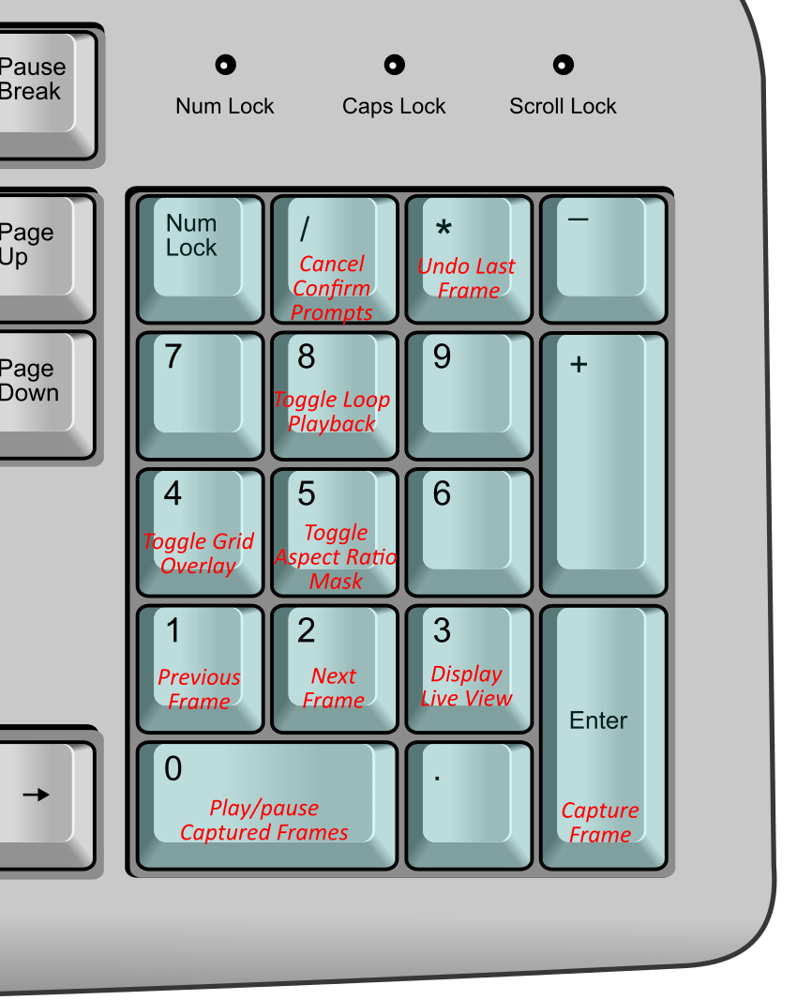

# Keyboard shortcuts
There are numerous keyboard shortcuts available in Boats Animator; here is a comprehensive list of all of them.

!!! note "Note for macOS users:"
    The `Command` key should be used in place of any shortcuts listed with `Ctrl` in them.

| Action | Primary | Alternative |
|-|-|-|
| **Main shortcuts** | | |
| Capture frame | **`Ctrl 1`** | **`Enter`** |
| Undo last frame | **`Ctrl Z`** | **`*`** |
| Delete current selected frame | **`Delete`** | **`Backspace`** |
| Toggle audio | **`Ctrl M`** | |
| Play / pause playback | **`Space`** | **`0`** |
| Toggle playback looping | **`8`** | |
| Live view | **`L`** | **`3`** |
| Display first frame | **`Ctrl Left`** | |
| Display last frame | **`Ctrl Right`** | |
| Display previous frame | **`Left`** | **`1`** |
| Display next frame | **`Right`** | **`2`** |
| Toggle grid overlay | **`4`** | |
| Toggle aspect ratio mask | **`5`** | |
| | | |
| **Confirm prompts** | | |
| Select confirm button | **`Enter`** | |
| Cancel confirm prompt | **`Esc`** | **`/`** |

## Shortcuts on a number keypad
Boats Animator's shortcuts have been chosen so that the most common can be accessed using a number keypad:

