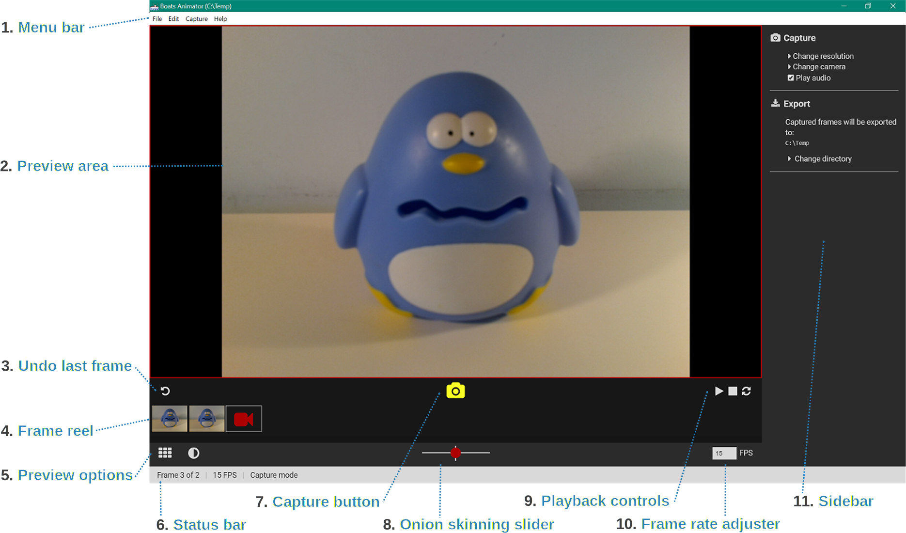
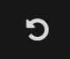
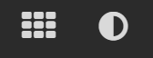
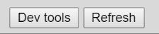
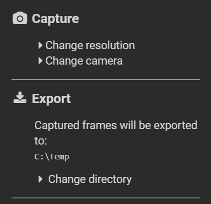

# Main window

## Menu bar

The menu bar contains an assortment of options both to do with the current project and the program in general.

### File menu
* **New project:** this has not been implemented yet.
* **Open project:** this has not been implemented yet.
* **Main menu:** select this to return to the [launcher window](launcher-window.md).

### Edit menu
* **Delete last frame:** select this to activate the [undo last frame](#undo-last-frame) button.

### Capture menu
* **Capture frame:** select this to activate the [capture button](#capture-button).

### Help menu
* **Online manual:** select this to view Boats Animator's [documentation](http://boatsanimator.readthedocs.org/). **Shortcut: `<F1>`**
* **Give feedback:** select this to load the [issues page](https://github.com/BoatsAreRockable/Boats-Animator/issues) of Boats Animator's GitHub repository.
* **About Boats Animator:** select this to load the [about window](about-window).

### Debug menu
* **Load developer tools:** this opens the devtools to inspect the window. This feature is intended for usage by developers of Boats Animator.

## Preview area

The preview area shows a live feed of the selected camera in [capture mode](#capture-mode) and is where frames are played back in [playback mode](#playback-mode). In capture mode a red border is displayed around the preview area.

## Undo last frame
**Shortcut: `<Ctrl+Z>`**

Select this to remove the last frame in the frame reel and delete it permanently from the hard-drive. After selecting this a confirm dialogue with "Are you sure you want to delete the last frame captured?" is displayed.

## Frame reel

The frame reel area displays thumbnails of all of the frames that have been captured. To preview a particular frame in the preview area simply select it from the frame reel. The current frame being previewed will have a white outline around it in the frame reel and playback will begin from this frame.

### Live-view button
On the far right of the frame reel is the live-view button. After previewing captured frames, select this to return to [capture mode](#capture-mode). In capture mode this button has a white outline around it.

## Preview options

The preview options buttons change what masks are displayed on the preview area.

### Grid toggle
This enables / disables a [rule of thirds](https://en.wikipedia.org/wiki/Rule_of_thirds) grid over the preview area. **Please note that this feature has not been implemented yet**.

### Onion skinning toggle
This enables / disables [onion skinning](https://en.wikipedia.org/wiki/Onion_skinning), which is when a translucent version of the last image captured is displayed on top of the preview area. The onion skinning strength is set with the [onion skinning slider](#onion-skinning-slider). Onion skinning is only displayed in [capture mode](#capture-mode).

## Status bar

The status bar contains useful information about the current project.

### Current frame
`Frame x of y`

This is an indicator of what is currently being displayed in the preview area. When in capture mode `x` is equal to one more than the number of frames currently captured. The logic here is: "once this picture is taken it will become the `x`th frame captured."

### Current FPS
`xx FPS`

This is the frame rate that will be used to playback frames. The playback frame rate can be adjusted using the [frame rate adjuster](#frame-rate-adjuster).

### Current mode
`x mode`

This is the current mode Boats Animator is in.

#### Capture mode
This is when a live-feed of the selected camera is displayed in the preview area. Capture mode is accessed by selecting the [live-view button](#live-view-button).

#### Playback mode
This is when a captured frame is displayed in the preview area. Preview mode can be accessed either by selecting a captured frame from the [frame reel](#frame-reel) or by selecting the play button.

## Capture button
**Shortcut: `<Ctrl+C>`**

Select this button to capture a new frame from the live-feed that is visible in [capture mode](#capture-mode).

## Onion skinning slider

This is used to set the amount of [onion skinning](https://en.wikipedia.org/wiki/Onion_skinning) to be displayed in the preview area in [capture mode](#capture-mode). Move the slider to the left to make the live-feed more visible and to the right to make the last frame captured more visible.

!!! note "Note"
    Remember that this slider only has an effect when the [onion skinning toggle](#onion-skinning-toggle)  is enabled.

## Playback controls

These buttons affect the playback of captured frames in the [preview area](#preview-area).

### Playback frames
When this is selected playback will begin from the first frame captured or resume from the current frame being previewed if in [playback mode](#playback-mode).

### Pause playback
The playback frames button switches to a pause button during playback. Selecting it pauses playback at the current frame being previewed.

### Stop playback
Select this to stop playback and jump to the last frame captured.

### Loop playback
Select this to toggle if playback should continue from the first frame captured when the last frame captured is reached.

## Frame rate adjuster

This is used to set the number of frames per second to be displayed during playback. Whole numbers between 1 and 60 are accepted.

## Debugging tools

These features are intended for usage by developers of Boats Animator. They will be hidden in future versions.

### Dev tools
This opens the devtools to inspect the window.

### Refresh
This reloads the window.

!!! warning "Warning"
    A known issue is that this causes the NW.js APIs to stop working when used multiple times. **Using this feature is not recommended.**

## Sidebar

The sidebar contains options that are generally not changed very often during animating.

### Change resolution and change camera
These features have not been implemented yet, although we are working on doing so and are aware that there is a strong demand for them!

### Play audio
This toggles whether the program should play sounds. The only sound currently used in Boats Animator is a shutter "clicking" sound when the [capture button](#capture-button) is pressed.

### Change directory
Select this to change the folder Boats Animator exports captured frames to.

!!! warning "Warning"
    Please be aware that Boats Animator will overwrite the existing frames in this directory if it has been used for a project before. This behaviour will be changed in a future version.