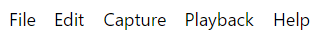

# Menu Bar

The menu bar contains an assortment of options both to do with the current project and the program in general. The menu bar is located in the [Main Window](/interface/main-window).

!!! note "Note for macOS users"
    The menu bar will show some additional items to those listed here. These features are part of macOS rather than specifc to Boats Animator.

### File menu

**Main Menu:** select this to return to the [launcher window](/interface/launcher-window).

**Exit:** select this to close the program.

### Edit menu

**Delete Last Frame:** this will remove the last frame of your animation and delete it permanently from the hard-drive. A dialog box with "Are you sure you want to delete frame X?" is displayed before deletion occurs.

### Capture menu

**Capture Frame:** select this button to capture a new frame from the live-feed that is visible in capture mode.

**Conform Take:** select this to rename all of the captured frames file names to be sequential.

**Play Capture Sounds:** this toggles whether a sound plays when a frame is captured.

**Change Capture Destination:** select this to change the folder Boats Animator exports captured frames to.

### Playback menu

**Loop Playback:** this toggles if playback should continue from the first frame captured when the last frame captured is reached.

**Display First Frame:** this displays the first frame captured.

**Display Last Frame:** this displays the last frame captured.

### View menu

**Toggle Developer Tools:** this opens the Electron developer tools. They are used to diagnose any issues with the application.

**Actual Size:** this resets the size of the user interface if it has been changed.

**Zoom In:** this increases the size of the user interface.

**Zoom Out:** this decreases the size of the user interface.

**Toggle Full Screen:** this sets the application to be full screen. Select this option again or use the keyboard shortcut `F11` to leave full screen.

### Help menu

**Documentation:** select this to view Boats Animator's [documentation](https://help.boatsanimator.com/) (the website you are currently on!).

**Give Feedback:** select this to load the [issues page](https://github.com/charlielee/boats-animator/issues) of Boats Animator's GitHub repository.

**View License:** select this to view Boats Animator's terms and conditions.

**Official Website:** select this to visit <https://www.charlielee.uk/boats-animator>.
