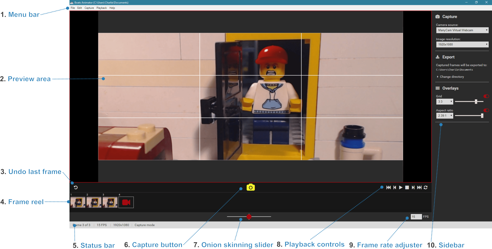

# Welcome to Boats Animator!

A free, open-source stop motion animation program. This provides a comprehensive guide to all of Boats Animator's features.

If you come across a mistake with this documentation please consider [editing it](https://www.github.com/charlielee/boats-animator/tree/master/docs) on GitHub or [contacting the author](https://www.charlielee.uk/contact/) of this project.

* **Official homepage:** <https://www.charlielee.uk/boats-animator>
* **GitHub repository:** <https://github.com/charlielee/boats-animator>

