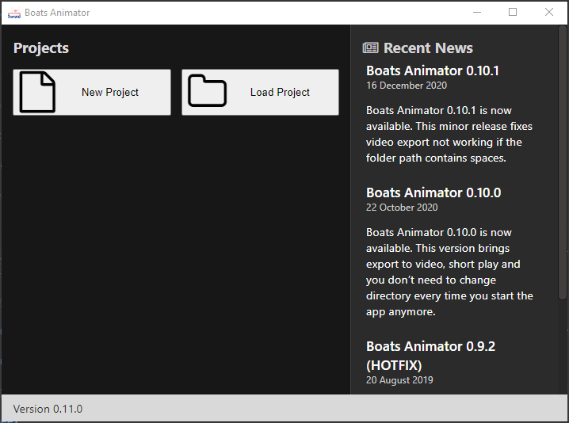

# Launcher Window

The launcher window is the screen that appears after Boats Animator is launched.

## New Project

Select this button to begin a new animation.

## Version number

The version of Boats Animator you are currently using is displayed here. The [releases section](https://github.com/charlielee/boats-animator/releases) of Boats Animator's GitHub repository should be periodically checked for new versions.

## News feed

This displays the latest news about Boats Animator. Select the title of a news item to view the full post.
