# Main Window

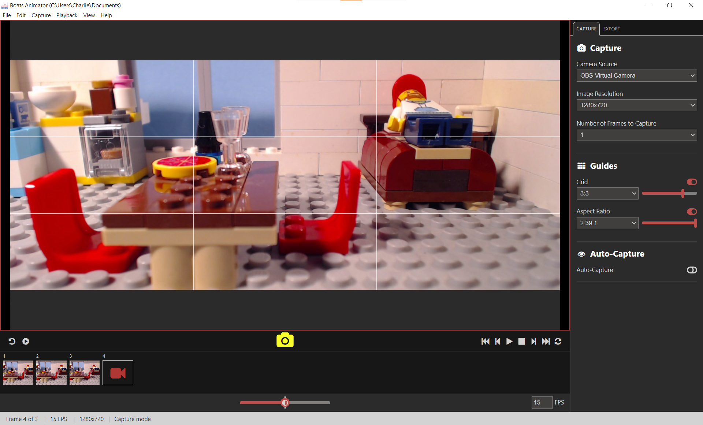

The main window is where you will spend most of your time with Boats Animator.

## Menu bar


The menu bar contains an assortment of options both to do with the current project and the program in general. See [Menu Bar](/features/menu-bar) for further information.

## Preview area

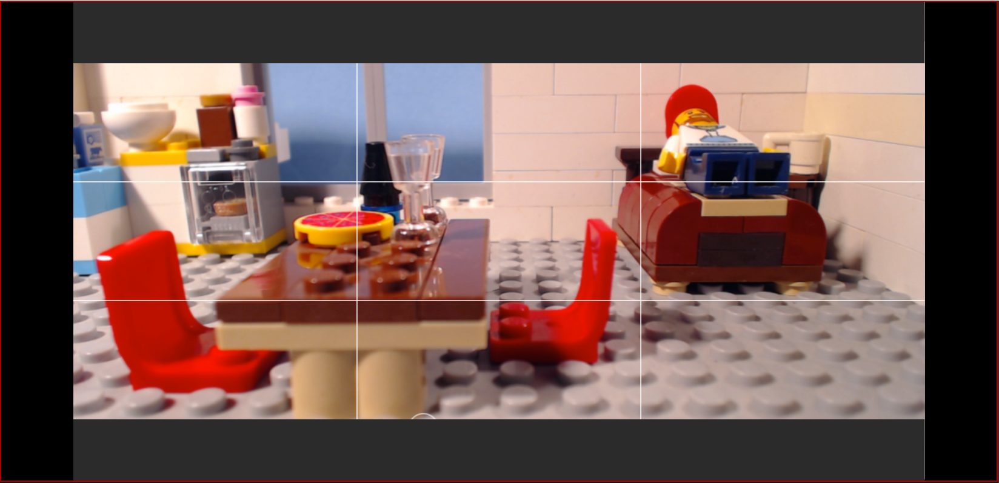

The preview area shows a live feed of the selected camera in **capture mode** and is where frames are played back in **playback mode**. In capture mode a red border is displayed around the preview area.

## Animation toolbar

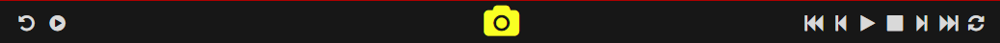

The animation toolbar contains options for manipulating your animation.

### Left controls

The left controls shown change depending on whether you are in **capture mode** or **playback mode**.

#### Capture mode

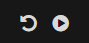

**Undo last frame:** this will remove the last frame of your animation and delete it permanently from the hard-drive. A dialog box with "Are you sure you want to delete frame X?" is displayed before deletion occurs.

**Short play:** this will playback the last 5 frames of your animation.

#### Playback mode


**Delete selected frame:** this will remove the currently selected frame of your animation and delete it permanently from the hard-drive. A dialog box with "Are you sure you want to delete frame X?" is displayed before deletion occurs.

### Capture button

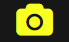

Select this button to capture a new frame from the live-feed that is visible in **capture mode**.

### Playback controls

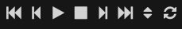

These buttons affect the playback of captured frames in the [preview area](#preview-area).

**First frame:** this displays the first frame captured.

**Previous frame:** this displays one frame before the current frame being displayed.

**Playback/pause frames:** this will begin playback from the first frame captured or resume it from the current frame being displayed if in **playback mode**. If playback has already started this button will pause it.

**Stop playback:** this will stop playback and jump to the last frame captured.

**Next frame:**  this displays one frame after the current frame being displayed.

**Last frame:** this displays the last frame captured.

**Loop playback:** this toggles if playback should continue from the first frame captured when the last frame captured is reached.

## Frame reel

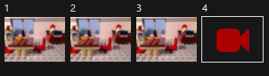

The frame reel area displays thumbnails of all of the frames that have been captured. To display a particular frame in the [preview area](#preview-area) simply select it from the frame reel. The current frame being previewed will have a white outline around it in the frame reel and playback will begin from this frame.

**Live-view button:** on the far right of the frame reel is the live-view button. After previewing captured frames, select this to return to **capture mode**. In capture mode this button has a white outline around it.

## Onion skinning slider

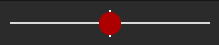

This is used to set the amount of [onion skinning](https://en.wikipedia.org/wiki/Onion_skinning) that is displayed in the preview area in **capture mode**. Move the slider to the right of center to increase the opacity of the last frame captured. At present, moving the slider to the left will have the same effect. To turn off onion skinning move the slider back to the center.

## Frame rate adjuster

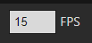

This is used to set the number of frames per second to be displayed during playback. Whole numbers between 1 and 60 are accepted.

## Status bar

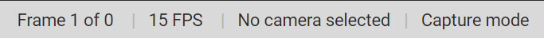

The status bar contains useful information about the current project. See [Status Bar](/features/status-bar) for further information.

## Sidebar

The sidebar contains options that are changed less often during animating. There are two tabs, **Capture** and **Export**.

### Capture tab

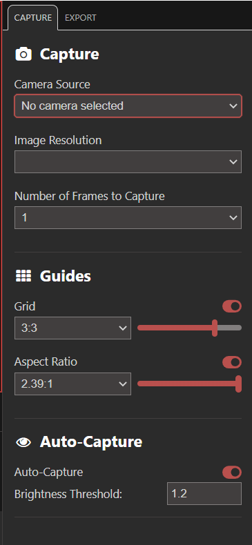

#### Capture

##### Camera Source

This is used to select the device to capture frames with. The list will automatically update if a device is plugged in or unplugged. Please see the [Supported Cameras](/introduction/cameras) page for further information about camera sources.

##### Image Resolution

This is used to select the resolution to capture frames at. This list will only show resolutions that are supported by the current **camera source**. The last resolution selected will be remembered when you restart Boats Animator.

##### Number of Frames to Capture

This indicates how many frames will be captured at once. This may be useful for a common stop motion technique called "shooting on twos".

#### Guides

Guides are visuals that display over the [preview area](#preview-area). They are for reference only and will not show on capture frames or exported videos.

Use the relevant toggle button to enable an overlay, and then you can adjust it via a drop-menu and opacity slider.

##### Grid overlay

This displays a grid over the preview area in **capture mode**. The grid is commonly used to help follow the [rule of thirds](https://en.wikipedia.org/wiki/Rule_of_thirds).

##### Aspect ratio mask

This displays a mask over the preview area with the selected aspect ratio. This may be useful if you camera doesn't natively support the desired resolution.

#### Auto-Capture

This feature is used to synchronize taking images with a DSLR whose video output is connected via a capture card. The connected DSLR must have "Image Review" or equivalent setting enabled. If Auto-Capture is enabled, it will wait for a black frame (indicating the DSLR is taking a photo), and then capture the next visible frame, which corresponds to the actual photo taken by the DSLR. The quality of this image is often significantly better than the live preview, and corresponds exactly to the full-quality image saved on the DSLR's memory card.

##### Brightness Threshold

This value determines the brightness threshold (0 - 255) between a black frame (DSLR is taking a photo) and visible frame. Note that sufficiently dark scenes are indistinguishable from the black frames a DSLR outputs while taking a photo, so pictures may be erroneously captured as the brightness level floats around the threshold value.

### Export tab

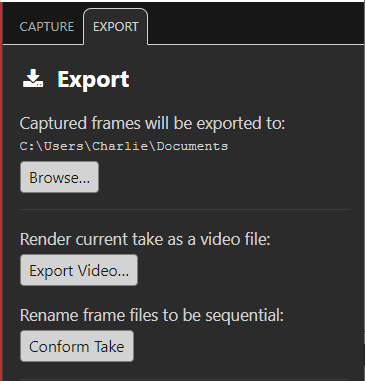

#### Change Directory

Select this to change the folder Boats Animator exports captured frames to.

#### Export Video

Select this to render the captured frames as a video file. You must capture at least one frame for this option to be available. See [Export Video](/features/export-video) for further information.

#### Conform Take

Select this to rename all of the captured frames file names to be sequential. This action is automatically run when you select **Export Video**. This may be useful when you wish to use the image files captured by Boats Animator in video editing software. Some applications that enable importing an image sequence expect the files to have names with incrementing numbers (for example `frame001.png`, `frame002.png`, `frame003.png`).

In Boats Animator, each frame you capture will have an incrementing file name, however when you delete a frame you can end up with a gap. For example if you capture 4 frames:

```
frame001.png
frame002.png
frame003.png
frame004.png
```

If you then deleted `frame003.png`, you would end up with files named:

```
frame001.png
frame002.png
frame004.png
```

This is not a valid image sequence because of the gap between `frame002.png` and `frame004.png`. Running **Conform Take** will fix this and rename the files so you end up with files named:

```
frame001.png
frame002.png
frame004.png
```
