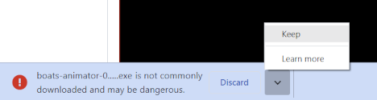
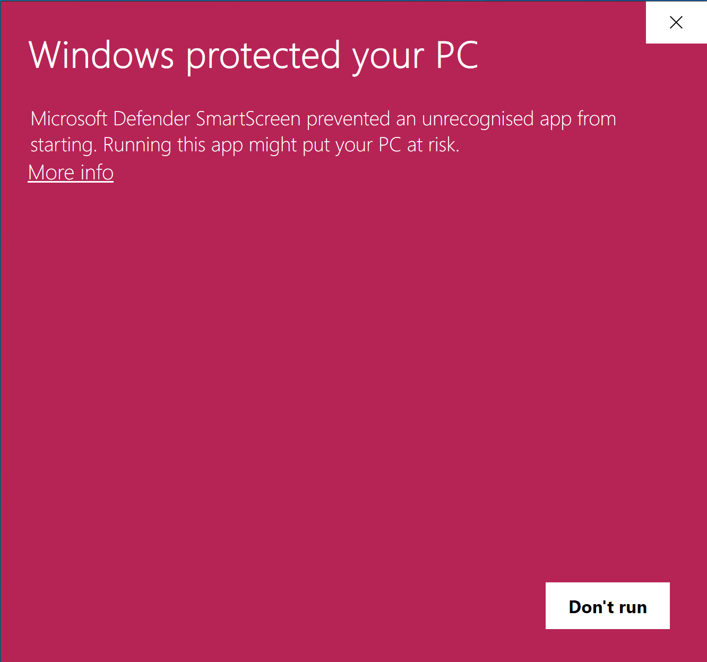
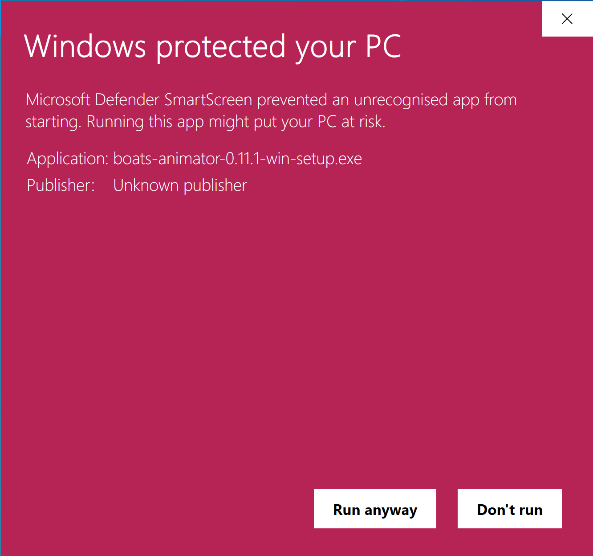
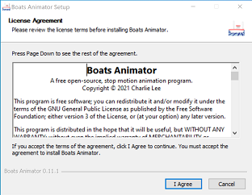
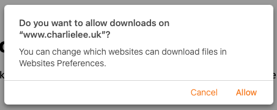
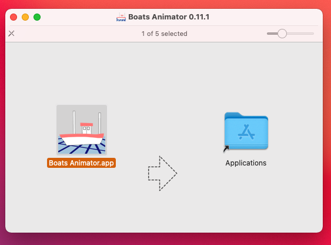
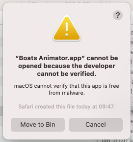
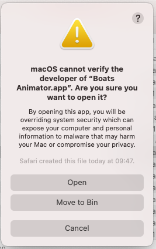

# Download and Installation Guide

Thank you for choosing to download Boats Animator! Here is a guide to installing the application and some of the common issues you may come across.

## Windows

1. [Visit the Boats Animator website](https://www.charlielee.uk/boats-animator/#downloads) and select the Windows Setup .exe download.
2. Select `Keep` if prompted by your web browser. 
3. Once the download is finished, open the downloaded file.
4. If a SmartScreen message appears, select `More info` and `Run anyway`.  
5. Follow the installation wizard instructions. 
6. Once installation is completed, start the application by selecting Boats Animator from the Windows Start Menu or Desktop (if you chose to create a desktop shortcut).

## macOS

1. [Visit the Boats Animator website](https://www.charlielee.uk/boats-animator/#downloads) and select the macOS .dmg download.
2. Select `Allow downloads` or `Keep` if prompted by your web browser.  
3. Once the download is finished, open the downloaded file and drag the `Boats Animator.app` icon onto the `Applications` folder icon. 
4. Double click `Applications` and find `Boats Animator` in the list of Applications.
5. Select the Boats Animator entry to start the application.
6. You may see the message `"Boats Animator.app" cannot be opened because the developer cannot be verified.`. To fix this, select `Cancel`, press `control + click` on the `Boats Animator` entry and choose `Open`. This will display a different message with the option to open the program. This step is only necessary the first time you open Boats Animator.  
7. The first time you open Boats Animator you will be prompted to allow access to the camera. Select `OK` if you want to be able to capture images! 

## Linux

1. [Visit the Boats Animator website](https://www.charlielee.uk/boats-animator/#downloads) and select the Linux .deb download.
2. Open the download is finished, open the download file.
3. Boats Animator will now be added to your application menu.

!!! note "Note"
    If you require a different Linux package type then please [visit the code repository](https://github.com/charlielee/boats-animator/) for instructions on building your own binaries.

## Is Boats Animator safe? Why do I have to ignore certain security messages?

Boats Animator has been downloaded from official sources over 25,000 times with no reports of malware. Windows and macOS show additional security warnings because the application is not currently code signed. This is due to the cost of purchasing different certificates for both Windows and macOS.

There are a few ways you can ensure you have the most secure experience using Boats Animator:

- ONLY download Boats Animator from the [official website](https://www.charlielee.uk/boats-animator/) or the [official code repository](https://github.com/charlielee/boats-animator/releases).

- If you have a knowledge of JavaScript, consider [inspecting the open source code](https://github.com/charlielee/boats-animator/) and building your own binaries.

- [Support the project's creator](https://ko-fi.com/charlielee) with a "tip" to enable features such as code signing in the future.
